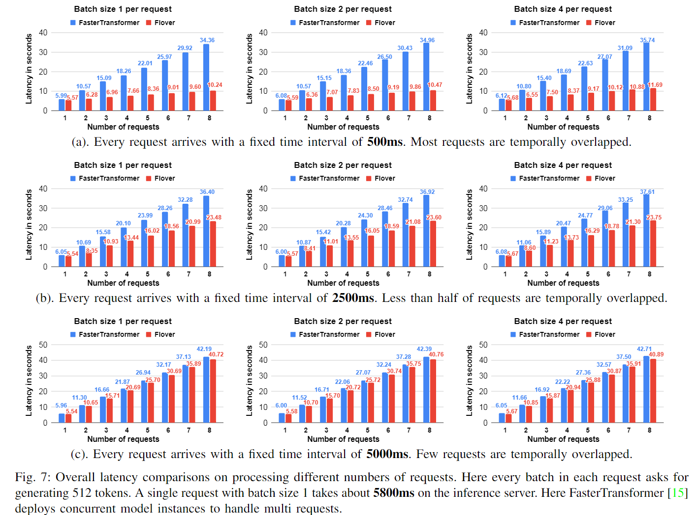
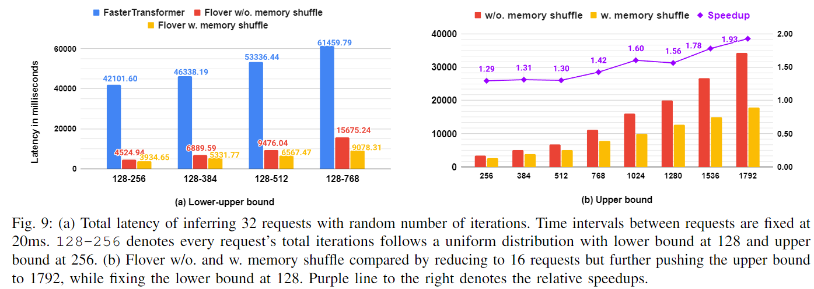
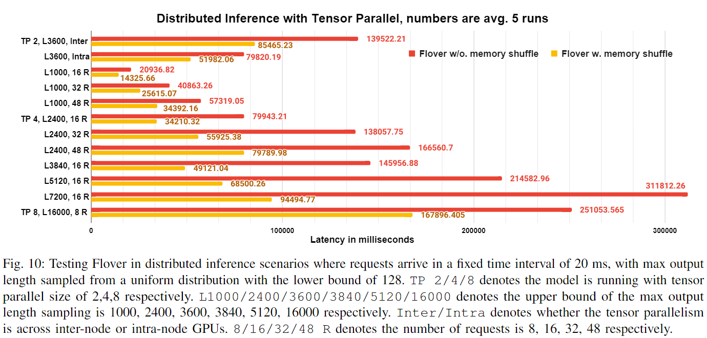

# Flover
A novel temporal fusion framework for propelling autoregressive model inference by leveraging the temporality property of inferring generative tasks, delivering superior and more fine-grained parallelism beyond all current solutions.
The code will be release at July.

**Structure**

---

**Comparison with FT in constant request time interval**

---

**Comparison with FT in random request time interval**

---

**Comparison with FT in random request output length (sampled from a uniform distribution)**

---

**Working with tensor parallelism**

---
