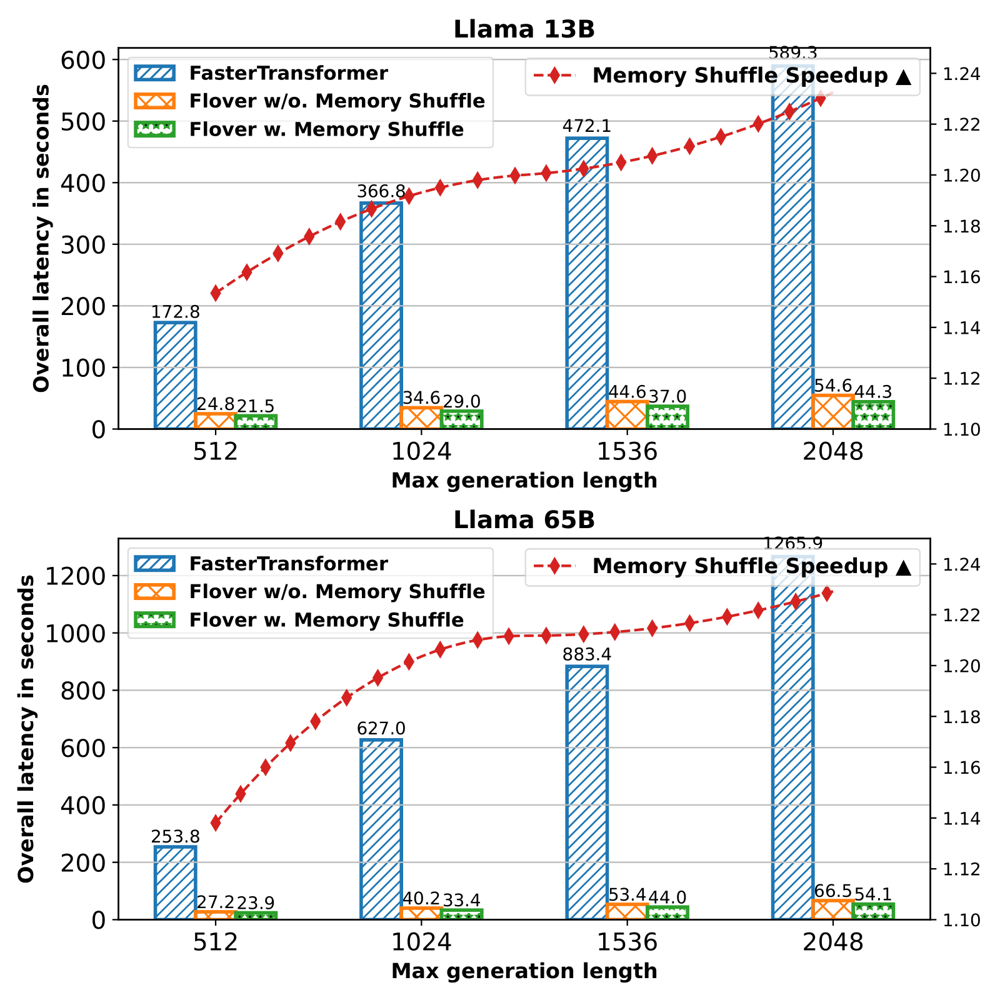

# Flover
A novel temporal fusion framework for propelling autoregressive model inference by leveraging the temporality property of inferring generative tasks, delivering superior and more fine-grained parallelism beyond all current solutions.
The code is now available.
Please refer to [arxiv](https://arxiv.org/abs/2305.13484) for details.

## Installation

### Environment
Flover is based on [FasterTransformer](https://github.com/NVIDIA/FasterTransformer.git), thus, you can follow it. We provide the option to build the project from source, make sure MPI and NCCL are installed in your system.

### Build from source
First, clone this repo:

```
git clone https://github.com/YJHMITWEB/Flover.git
cd Flover
mkdir build
cd build
```

We use Intel oneTBB in the project, therefore, make sure to enable it:
```
cmake -DSM={80, your hardware sm architecture} \
      -DCMAKE_BUILD_TYPE=Release \
      -DBUILD_MULTI_GPU={ON, if you want to use tensor parallelism} \
      -DTBB_INCLUDE_DIRS=oneTBB/include \
      -DTBB_LIBRARIES=oneTBB/lib64/libtbb.so \
      -DCMAKE_EXE_LINKER_FLAGS="-ltbb" ..
make -j
```
The build may take about 30 minutes depending on your system.

## Get Start

### Model config
We use the config file for model initialization, currently, we support GPT-J and LLaMA models. Config files are located in `Flover/src/flover/models/flover/configs`

```
[model_specification]
model_type=llama_13b                 ; gptj_6b, llama_13b, llama_33b
data_type=fp16                       ; fp32, bf16
max_concurrency=32                   ; maximum requests for fusion before OOM.
per_batch_size=1                     ; number of samples in each request
max_seq_len=512                      ; maximum generation length of each request
fixed_input_len=8
fixed_prompt_len=0
beam_width=1
tensor_para_size=1
pipeline_para_size=1                 ; we do not support pipeline parallelism

[runtime_hyperparameter]
top_k=1                              ; k value for top k sampling
top_p=0.0                            ; p value for top p sampling
temperature=1.0                      ; Use for sampling
repetition_penalty=1.0               ; Use for sampling
presence_penalty=0.0                 ; Only one of repetition_penalty and presence_penalty are allowed.
len_penalty=0.0
beam_search_diversity_rate=0.0
data_type=fp16
enable_custom_all_reduce=0
interval=1000                        ; Interval between requests. Poisson pattern requests can be enabled in the code.
use_mem_shuffle=1                    ; Use memory shuffle(reordering) default means requests have different generation lengths. 

[request]
request_output_len=504               ; If use_mem_shuffle=1, this represents the upper bound of request's generation length; else, it represents the uniform length of the generation.
```

Then use the following command to run Flover inference:
```
cd Flover/build
mpirun -n 1 [node name] bin/test_flover
```

### Visualization of in-flight requests
We currently provide a visualization terminal output. 

## Updates Nov.7, 23
We compare our work against the latest TensorRT-LLM on parallel inference multiple requests.


## Structure

---

**Comparison with FT in constant request time interval**


---


**Comparison with FT in random request time interval**


---


**Comparison with FT in random request output length (sampled from a uniform distribution)**

Here we introduce memory reordering to make sure the memory of early finished requests is freed.


---


**Hardware profiling with Nsight**


---
